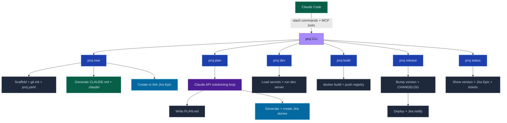
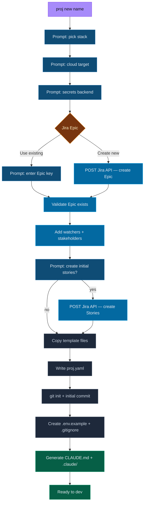
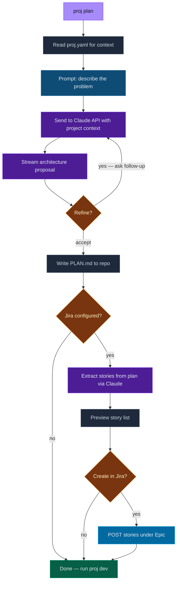
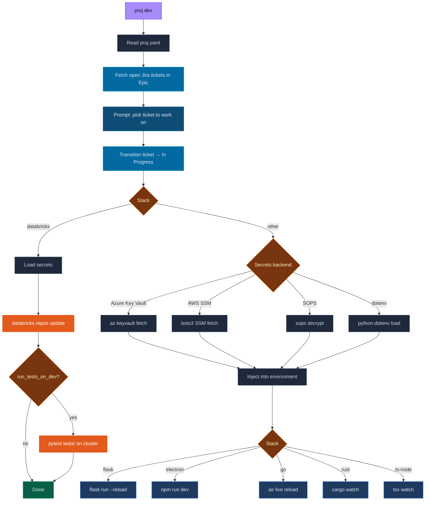
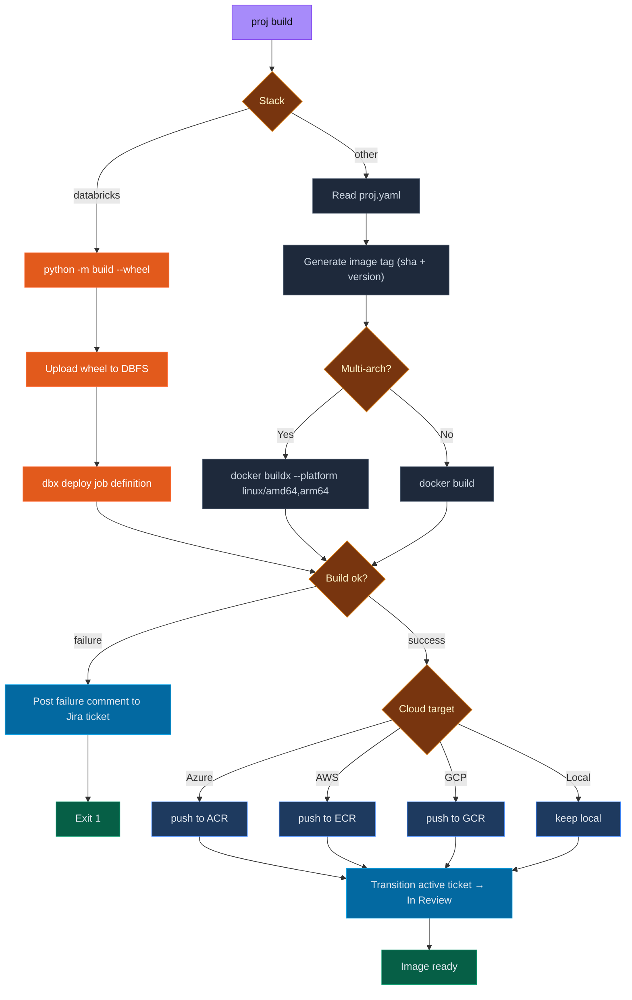
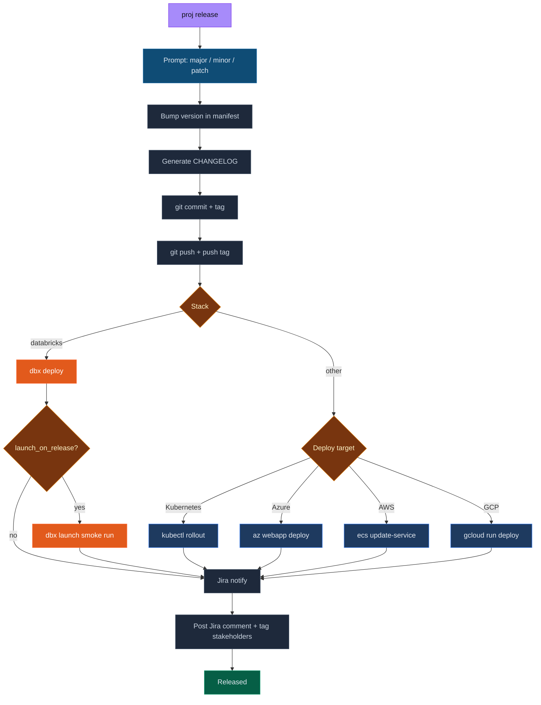
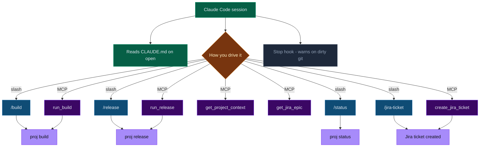

# Athena — Project Lifecycle CLI

Python-based CLI for managing the full project lifecycle across stacks, clouds, and teams.

📖 **[Complete Usage Guide →](GUIDE.md)**

---

## Full Workflow Overview



---

## proj new



---

## proj plan



---

## proj dev



---

## proj build



---

## proj release



---

## Claude Code Integration



---

## Install

```bash
pip install -e .
proj new my-project
```

## Commands

| Command | Description |
|---|---|
| `proj new <name>` | Scaffold a new project — stack, cloud, secrets, Jira Epic |
| `proj dev` | Load secrets and start the dev server |
| `proj build` | Docker build + push to cloud registry (or Databricks wheel upload) |
| `proj release` | Bump version, deploy, update Jira, notify stakeholders |
| `proj status` | Show version, git state, and live Jira Epic + tickets |
| `proj mcp` | Start MCP server for Claude Code integration |

## Stacks

`flask` · `electron` · `go` · `rust` · `ts-node` · `bi-report` · `databricks`

## Clouds

`azure` · `aws` · `gcp` · `local`

## Secrets backends

`dotenv` · `sops` · `azure-keyvault` · `aws-ssm` · `databricks-secrets`

## proj.yaml reference

```yaml
name: my-project
stack: flask           # flask | electron | go | rust | ts-node | bi-report | databricks
cloud: azure           # azure | aws | gcp | local
secrets_backend: dotenv
version: 0.1.0

jira:
  base_url: https://jira.corp.adobe.com
  project_key: BPOE
  epic_key: BPOE-84
  stakeholders:
    - john.doe
    - jane.smith

# Databricks only
databricks:
  repo_path: /Repos/you@adobe.com/my-project
  secret_scope: my-project
  wheel_path: dbfs:/FileStore/wheels/my-project
  job_name: my-project
  launch_on_release: false
```

## Claude Code integration

Each project scaffolded with `proj new` gets:
- `CLAUDE.md` — project context loaded automatically on session open
- `.claude/commands/` — `/build`, `/release`, `/status`, `/jira-ticket` slash commands
- `.claude/settings.json` — permissions and Stop hook

To connect the MCP server, add to `~/.claude/settings.json`:
```json
{
  "mcpServers": {
    "proj": {
      "command": "proj",
      "args": ["mcp"]
    }
  }
}
```
