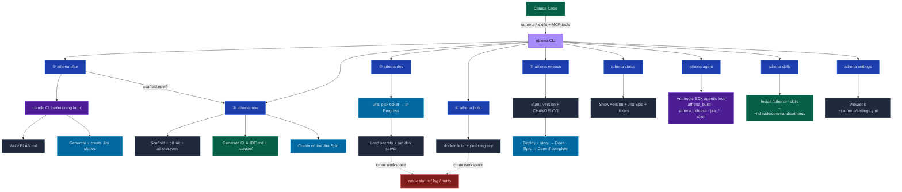
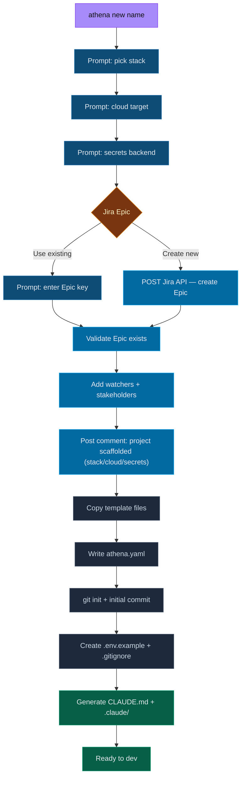
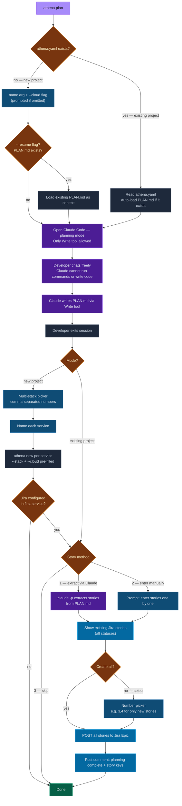
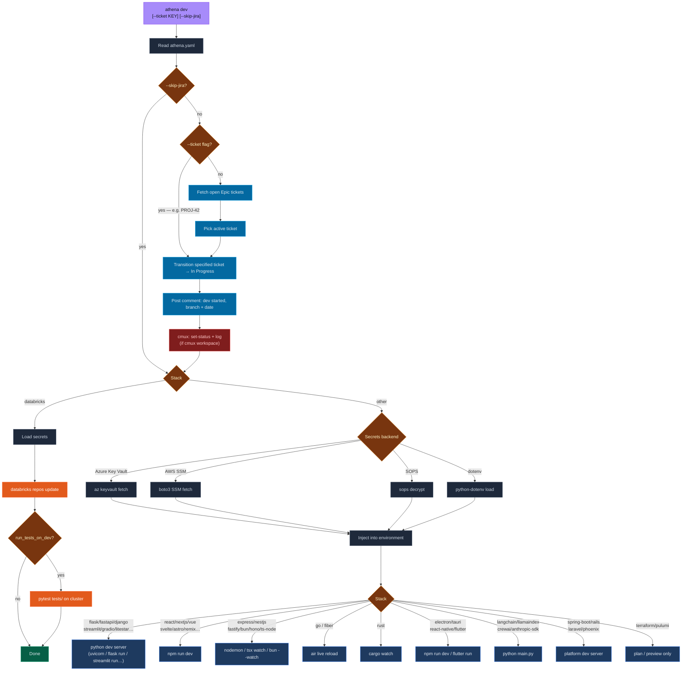
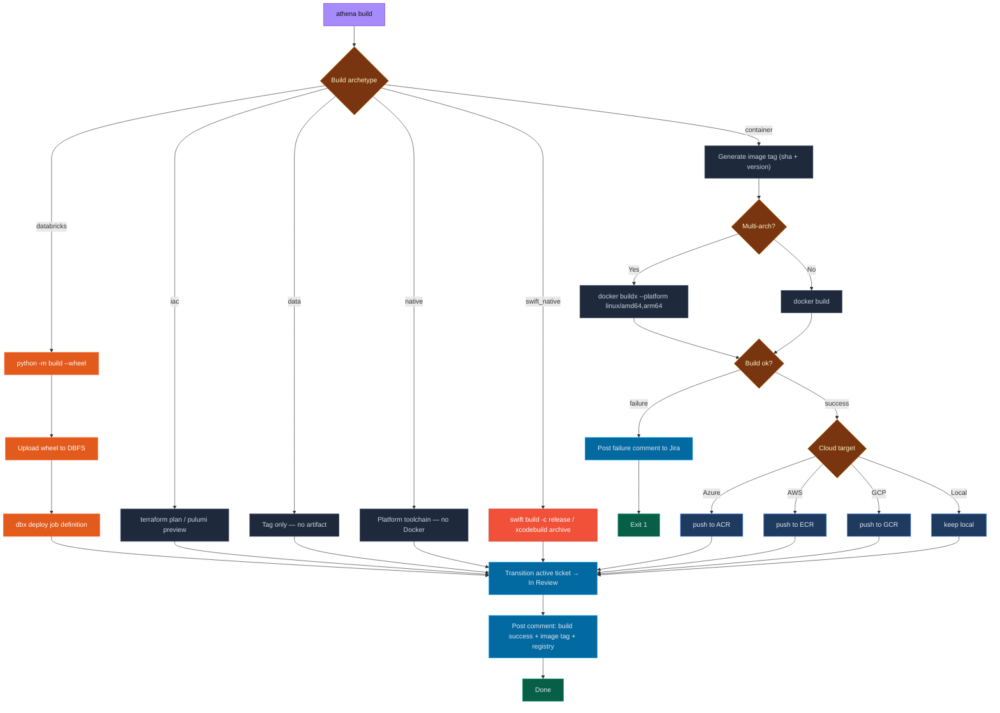
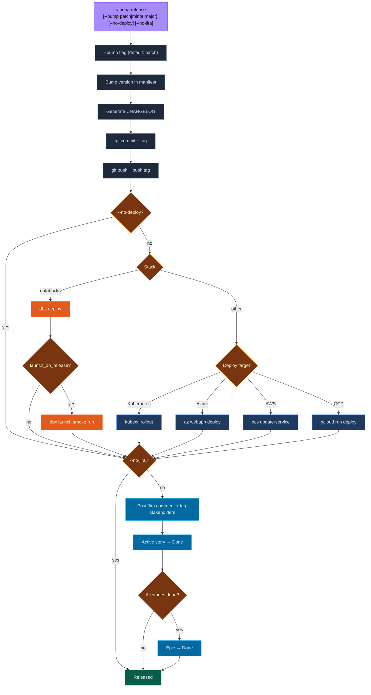
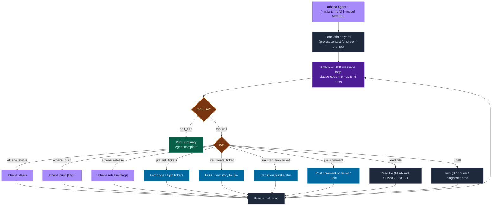
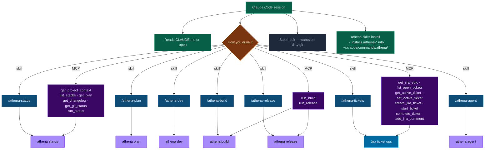

# Athena — Project Lifecycle CLI

Python-based CLI for managing the full project lifecycle across stacks, clouds, and teams.

📖 **[Complete Usage Guide →](GUIDE.md)**

---

## Full Workflow Overview



---

## athena new



---

## athena plan



---

## athena dev



---

## athena build



---

## athena release



---

## athena agent



---

## Claude Code Integration



---

## Install

```bash
pip install -e .
athena new my-project
```

## Commands

| Command | Description |
|---|---|
| `athena plan [name] [--cloud] [--resume]` | LLM-assisted solutioning via Claude Code CLI — writes PLAN.md, creates Jira stories |
| `athena new <name> [--stack] [--cloud]` | Scaffold a new project — stack, cloud, secrets, Jira Epic |
| `athena dev [--ticket KEY] [--skip-jira]` | Pick Jira ticket, load secrets, start dev server |
| `athena build [--multi-arch] [--no-push] [--no-jira]` | Docker build + push to cloud registry (or Databricks wheel upload) |
| `athena release [--bump patch\|minor\|major] [--no-deploy] [--no-jira] [--dry-run]` | Bump version, deploy, close Jira story, notify stakeholders |
| `athena status` | Show version, git state, and live Jira Epic + tickets |
| `athena agent "<goal>" [--max-turns N] [--model MODEL]` | Autonomous agent — describe a goal, runs the full lifecycle via Anthropic SDK |
| `athena skills install\|uninstall\|list` | Install `/athena-*` slash commands into `~/.claude/commands/athena/` |
| `athena settings set\|get\|unset\|list` | View and edit global user settings in `~/.athena/settings.yml` |
| `athena lazymode` | Full-screen retro TUI dashboard — all commands one keypress away |
| `athena mcp` | Start MCP server for Claude Code integration (stdio) |
| `athena help` | List all commands, lifecycle order, and common flags |

## Stacks

**Python:** `flask` · `fastapi` · `django` · `python-cli` · `streamlit` · `gradio` · `litestar` · `fasthtml` · `celery`  
**Node/TS:** `express` · `nestjs` · `ts-node` · `fastify` · `bun` · `hono`  
**Frontend:** `react` · `nextjs` · `vue` · `svelte` · `angular` · `astro` · `remix` · `solidjs`  
**Systems:** `go` · `rust` · `dotnet` · `zig` · `kotlin` · `java`  
**Desktop/Mobile:** `electron` · `tauri` · `react-native` · `flutter` · `wails` · `expo`  
**Data/ML:** `databricks` · `jupyter` · `mlflow` · `dbt` · `bi-report` · `airflow` · `huggingface` · `pytorch` · `spark`  
**AI/LLM:** `langchain` · `llamaindex` · `crewai` · `anthropic-sdk`  
**Other Backend:** `spring-boot` · `rails` · `laravel` · `fiber` · `phoenix` · `graphql` · `grpc`  
**IaC:** `terraform` · `pulumi` · `ansible` · `helm` · `cdk` · `bicep`  
**Swift/Apple:** `swift` · `vapor` · `swiftui` · `ios`

## Clouds

`azure` · `aws` · `gcp` · `local`

## Secrets backends

`dotenv` · `sops` · `azure-keyvault` · `aws-ssm` · `databricks-secrets`

## athena.yaml reference

```yaml
name: my-project
stack: flask           # flask | electron | go | rust | ts-node | bi-report | databricks
cloud: azure           # azure | aws | gcp | local
secrets_backend: dotenv
version: 0.1.0

jira:
  base_url: https://jira.corp.adobe.com
  project_key: BPOE
  epic_key: BPOE-84
  stakeholders:
    - john.doe
    - jane.smith

# Databricks only
databricks:
  repo_path: /Repos/you@adobe.com/my-project
  secret_scope: my-project
  wheel_path: dbfs:/FileStore/wheels/my-project
  job_name: my-project
  launch_on_release: false
```

## Claude Code integration

Each project scaffolded with `athena new` gets:
- `CLAUDE.md` — project context loaded automatically on session open
- `.claude/settings.json` — permissions and Stop hook

To install global `/athena-*` skills usable in **any** Claude Code session:
```bash
athena skills install
```
This writes 9 skill files to `~/.claude/commands/athena/`:
`/athena-status` · `/athena-plan` · `/athena-dev` · `/athena-build` · `/athena-release` · `/athena-tickets` · `/athena-new` · `/athena-lazy` · `/athena-agent`

To connect the MCP server, add to `~/.claude/settings.json`:
```json
{
  "mcpServers": {
    "athena": {
      "command": "athena",
      "args": ["mcp"]
    }
  }
}
```
